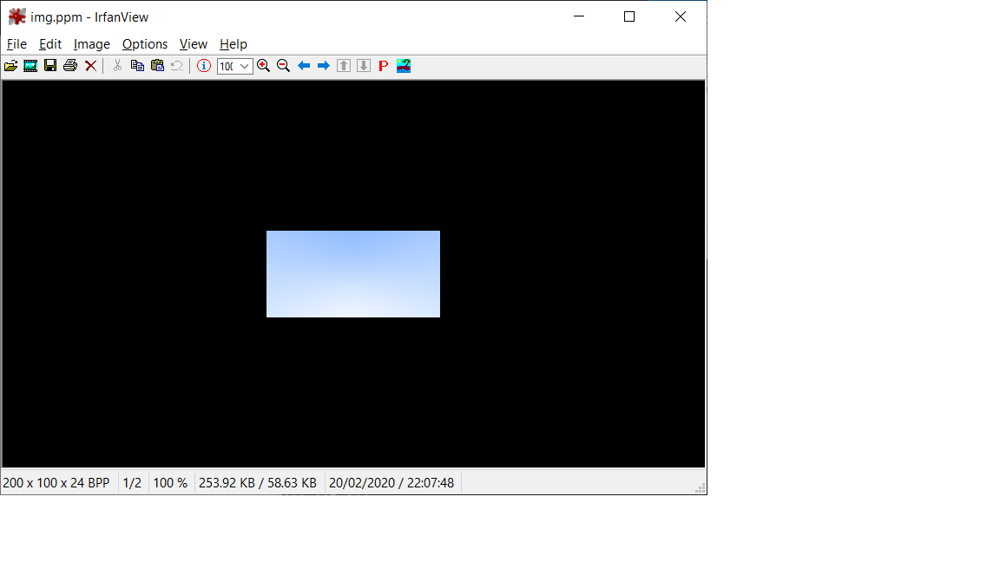

# ray_tracer
A simple ray tracer in C++ from first principles. A work in progress.

Positions and colours can be represented by vec3 class.

Outputs ppm image data to console, pipe it to \*.ppm file to view it.

(ppm image files can be opened by IrfanView or similar)

# Building

Build scripts for Windows (build.bat) and MacOS/Linux (build.sh)
Requires clang

Compiles just RayTracer.cpp.

Output lands in bin/, which is cleared on each build.

# Running
run bin/RayTracer.exe > image.ppm

# Result

Here is the image produced right now, this will change as things advance :)

( will probably change this to a png or something soon because github won't inline a ppm )

